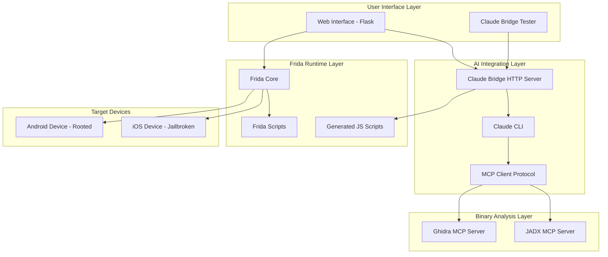
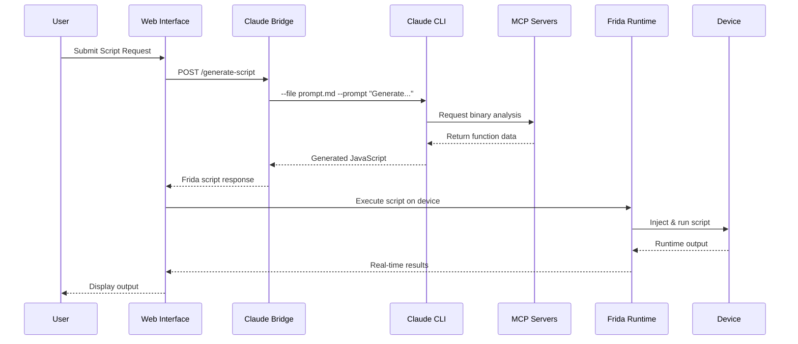
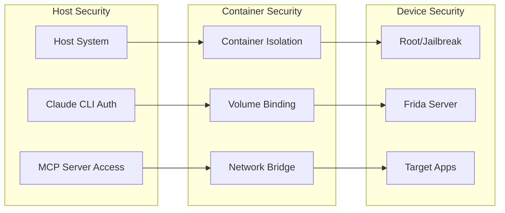
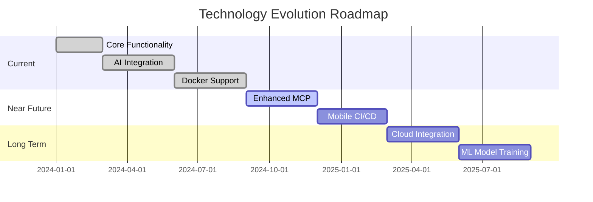

# Technology Mapping - Frida Script Runner

## High-Level Architecture Overview



## Detailed Component Technology Stack

### Frontend Technologies
```
┌─────────────────────────────────────┐
│           Frontend Stack           │
├─────────────────────────────────────┤
│ • HTML5 + CSS3 + JavaScript        │
│ • Bootstrap 4.x (UI Framework)     │
│ • Socket.IO (Real-time Updates)    │
│ • Fetch API (HTTP Requests)        │
│ • WebSocket (Live Output Stream)   │
└─────────────────────────────────────┘
```

### Backend Technologies
```
┌─────────────────────────────────────┐
│           Backend Stack            │
├─────────────────────────────────────┤
│ • Python 3.11.x                   │
│ • Flask (Web Framework)           │
│ • Flask-SocketIO (WebSocket)      │
│ • Subprocess (CLI Integration)    │
│ • Threading (Async Operations)    │
│ • Requests (HTTP Client)          │
│ • Tempfile (Temporary Storage)    │
└─────────────────────────────────────┘
```

### AI & Analysis Technologies
```
┌─────────────────────────────────────┐
│        AI Integration Stack        │
├─────────────────────────────────────┤
│ • Claude CLI (Anthropic)          │
│ • MCP Protocol (Model Context)    │
│ • Ghidra (Binary Analysis)        │
│ • JADX (Android Decompiler)       │
│ • HTTP Bridge Server              │
│ • JSON-RPC Communication          │
└─────────────────────────────────────┘
```

### Mobile & Instrumentation
```
┌─────────────────────────────────────┐
│    Mobile Instrumentation Stack   │
├─────────────────────────────────────┤
│ • Frida 16.x+ (Instrumentation)   │
│ • ADB (Android Debug Bridge)      │
│ • ideviceinfo (iOS Tools)         │
│ • USB/TCP Communication           │
│ • ARM64/x86 Architecture Support  │
└─────────────────────────────────────┘
```

## Data Flow Architecture



## Technology Integration Map

```
┌─────────────────────────────────────────────────────────────────┐
│                    INTEGRATION ECOSYSTEM                        │
├─────────────────────────────────────────────────────────────────┤
│                                                                 │
│  ┌─────────────┐    ┌─────────────┐    ┌─────────────┐         │
│  │   Docker    │    │   Native    │    │   Hybrid    │         │
│  │             │    │             │    │             │         │
│  │ Container   │◄──►│ Host Setup  │◄──►│ Bridge Mode │         │
│  │ • Flask App │    │ • Claude CLI│    │ • Best of   │         │
│  │ • Frida     │    │ • MCP Srv   │    │   Both      │         │
│  └─────────────┘    └─────────────┘    └─────────────┘         │
│                                                                 │
├─────────────────────────────────────────────────────────────────┤
│                      COMMUNICATION LAYERS                       │
├─────────────────────────────────────────────────────────────────┤
│                                                                 │
│  HTTP/REST ◄──► WebSocket ◄──► JSON-RPC ◄──► Binary Protocol    │
│     │              │             │              │               │
│     v              v             v              v               │
│  Web API      Live Updates   MCP Comms    Frida Runtime        │
│                                                                 │
└─────────────────────────────────────────────────────────────────┘
```

## File System Technology Layout

```
Frida-Script-Runner/
├── 🐍 Python Backend Core
│   ├── frida_script.py          # Main Flask application
│   ├── claude-bridge.py         # AI integration bridge
│   └── requirements.txt         # Python dependencies
│
├── 🌐 Web Frontend
│   ├── templates/               # HTML templates
│   ├── static/                  # CSS, JS, images
│   └── js/                      # Frontend JavaScript
│
├── 🤖 AI Integration
│   ├── claude-bridge.py         # HTTP bridge server
│   ├── MCP configurations       # Binary analysis setup
│   └── prompt templates         # AI prompt engineering
│
├── 📱 Mobile Scripts
│   ├── scripts/android/         # Android Frida scripts
│   ├── scripts/ios/             # iOS Frida scripts
│   └── script.json              # Script metadata
│
├── 🐳 Containerization
│   ├── Dockerfile               # Container definition
│   ├── docker-compose.yml       # Multi-service setup
│   └── .dockerignore           # Container exclusions
│
└── 📚 Documentation
    ├── README.md               # Main documentation
    ├── TECH_MAPPING.md         # This file
    └── DOCKER.md              # Container setup guide
```

## Port & Service Mapping

```
┌─────────────────────────────────────────────────────────────────┐
│                        SERVICE PORTS                            │
├─────────────────────────────────────────────────────────────────┤
│                                                                 │
│  ┌─────────────┐  ┌─────────────┐  ┌─────────────┐  ┌─────────┐ │
│  │    5000     │  │    8090     │  │    8080     │  │  8650   │ │
│  │             │  │             │  │             │  │         │ │
│  │ Flask App   │  │ Claude      │  │ Ghidra      │  │ JADX    │ │
│  │ Main UI     │  │ Bridge      │  │ MCP Server  │  │ MCP     │ │
│  │             │  │ Tester      │  │             │  │ Server  │ │
│  └─────────────┘  └─────────────┘  └─────────────┘  └─────────┘ │
│                                                                 │
├─────────────────────────────────────────────────────────────────┤
│                     DEVICE CONNECTIONS                          │
├─────────────────────────────────────────────────────────────────┤
│                                                                 │
│  USB/ADB Connection     │  TCP/IP Connection    │ Frida Protocol │
│  • Android Devices     │  • Network Devices    │ • Port 27042   │
│  • Root Required       │  • Remote Testing     │ • TCP/USB      │
│  • Developer Mode      │  • WiFi Debugging     │ • JSON-RPC     │
│                                                                 │
└─────────────────────────────────────────────────────────────────┘
```

## Security & Permission Model



## Technology Dependencies Matrix

| Component | Primary Tech | Dependencies | Optional Enhancements |
|-----------|-------------|--------------|----------------------|
| **Web Interface** | Flask + Python 3.11 | Socket.IO, Bootstrap | Real-time updates |
| **AI Integration** | Claude CLI | MCP Protocol | Ghidra, JADX servers |
| **Mobile Runtime** | Frida 16.x+ | ADB, ideviceinfo | Root/Jailbreak access |
| **Containerization** | Docker Compose | Host bridge | Volume mounting |
| **Binary Analysis** | Ghidra/JADX | MCP servers | Function analysis |

## Performance & Scalability

```
┌─────────────────────────────────────────────────────────────────┐
│                    PERFORMANCE METRICS                          │
├─────────────────────────────────────────────────────────────────┤
│                                                                 │
│  Component          │ Latency    │ Throughput  │ Concurrency    │
│  ──────────────────────────────────────────────────────────────  │
│  Flask Web UI       │ <100ms     │ 50 req/s    │ Multi-user     │
│  Claude Bridge      │ 1-300s     │ 1 req/min   │ Sequential     │
│  Frida Runtime      │ <50ms      │ Real-time   │ Multi-device   │
│  MCP Analysis       │ 5-30s      │ On-demand   │ Cached results │
│  Device Connection  │ 100-500ms  │ Persistent  │ USB/Network    │
│                                                                 │
└─────────────────────────────────────────────────────────────────┘
```

## Future Technology Roadmap



## Integration Patterns

### 1. **Synchronous Pattern** (Traditional)
```
User Request → Flask → Frida → Device → Response
```

### 2. **Asynchronous Pattern** (AI-Enhanced)
```
User Request → Claude Bridge → MCP Analysis → Script Generation → Execution
```

### 3. **Hybrid Pattern** (Current Implementation)
```
User Input → AI Processing → Script Enhancement → Real-time Execution → Live Output
```

---

**This technology mapping provides a comprehensive view of the Frida Script Runner's technical architecture, integrations, and future evolution path.**